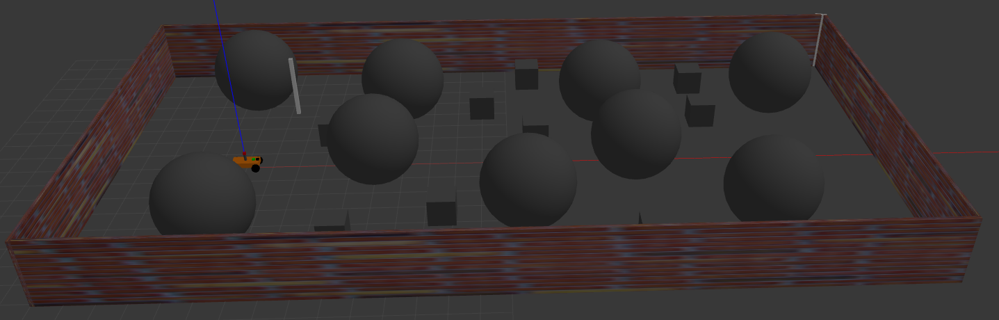

# SLAM: https://youtu.be/OBFY93SkfI0
# NAV2: https://youtu.be/dDSp_8K_5yw

**Packages:**

1. **car4_description**: robot model in URDF xacro
2. **car4_bringup**: Gazebo and RVIZ simulation, navigation2

**How to run:**

**build:**

`colcon build`

`source install/setup.bash`

**Terminal 1:** `ros2 launch car4_bringup navigation2.launch.py` 

Running simulation in Gazebo and RVIZ.

**Terminal 2:** `ros2 run teleop_twist_keyboard teleop_twist_keyboard` 

Controlling the robot.

**Robot Model**

 

**Frames & graph**

**Worlds in Gazebo**

**Track 1 easy**

**Track 2 medium**

**Track 3 hard**

**Generate a Map with slam_toolbox**

**Map after slam**

**ROS2 Nav2 Navigation**

**graph model with nav2**

